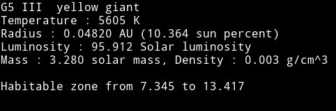
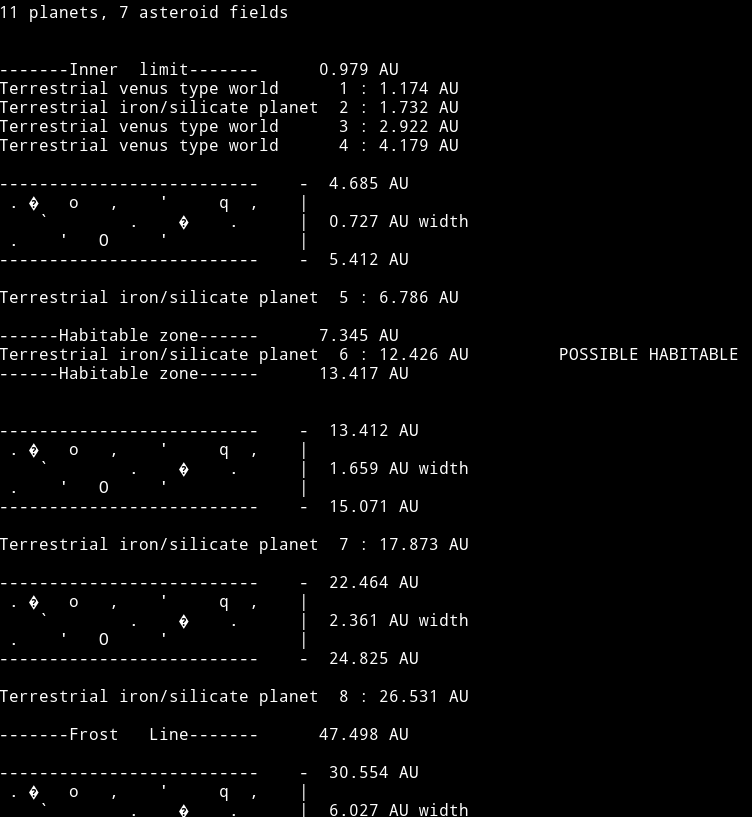
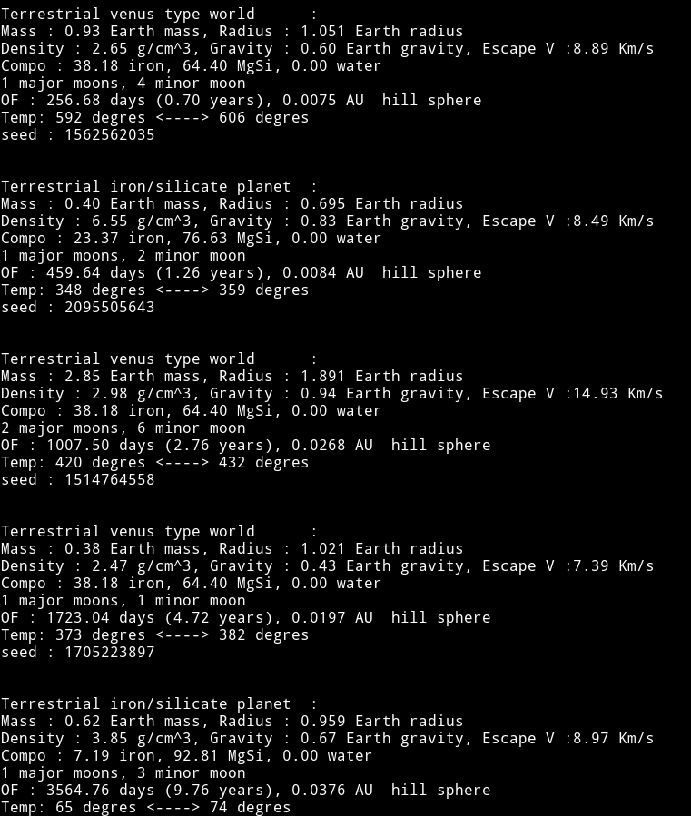

# Star-System-Procedural-Generator
Proceduraly generate a star system from a seed in C++.

I love studying the universe with maths and so after some lengthy researchs, I decided to use all my packaged informations to create a realistic star system generator.

The probabilities used in this program can represent an approximation of reality, or at least what we know of the universe yet.
Also I added modifications to include probable but not confirmed star types, like black dwarfs (that will probably exist in some billion years or so).

This program is a work in progress so some bugs can happen, specially for double star systems with giant stars.

## Exemple Output
Here is an exemple of a system outputed by the program (seed: 118347)

### The star

First, the star characteristics are displayed.
This star is a G5 III star, a yellow giant class with a mass close to our Sun.

### The System gloval view

Next, the simplified system is displayed.
Here you can see that the system is composed of 11 planets, 9 rocky planets and 2 gas giants.
Each planet is displayed with its planet type and its distance to the star (in Astronomical Units).
Asteroid Fields are represented as a band of characters, displayed with the inner and outer limits as well as the width.

A few theorical areas are displayed:
- System Inner limit: Theorical line under which no planet can orbit.
- System Habitable zone: Theorical area in which a planet can support life as we know it
- System frost line: Distance of the star at which the volatile componds (water, ammonia, methane, ...) turns into solid ice grains. 
- System Outer limit: Theorical limit after which no planet will orbit (Physically not really relevant)

### The System detailled view

This view shows every planet details, like mass, radius, composition, ...
Each terrestrial planet as a string description showing its composition :
- Pure iron : 100% iron
- Dense iron: 50% iron 50% Silicate
- Iron/silicate : 5% - 32.5% iron, 95% - 67.5% silicate (like Earth)
- Ocean : 22% iron, 52.5% silicate, 25% water
- Dense Ocean : 6.5% iron, 48.5% silicate, 45% water
- Pure Water world : > 99% water
- Gas: 2% iron, 95% Helium, 3% Hydrogen

Some planets can have this composition string replaced by an specific atmospheric and temperature description:
- Ice world: Frozen terrestrial world (Maximum temperature below 51 degrees Celsius), a body like Pluto for example.
- Cloudy world: Terrestrial world covered by a thick cloud layer (Temperature between 51 and 80.5 degrees Celsius).
- Venus Type: Terrestrial world with super dense and hot atmosphere (Temperature above 80.5).

A line also displays the number of major and minor moons.
A major moon is here an orbiting body maintained by its own gravity, and a minor moon is an orbiting body maintained by tensile strength.

The line OF shows the orbital period (planet year) in Earth days, with the planet Hill sphere (the limit after which the planetary body gravitational pull is inferior to the one of the main star).

The last line shows a range of surface temperatures, based on planetary characteristics and distance to the star.

